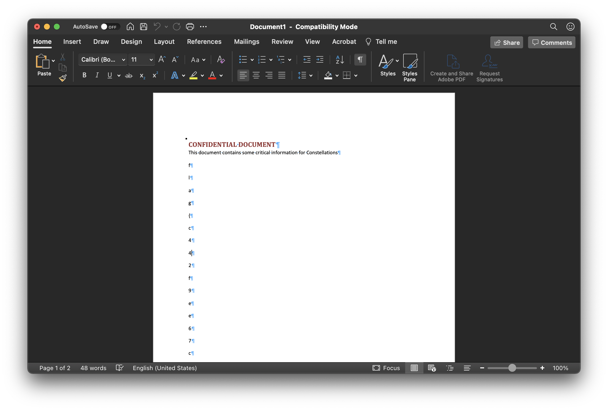

# typewriter

### Challenge Text

>Author: @congon4tor#2334
>
>A CONSTELLATIONS employee had his machine crash and he lost all his work. Thankfully IT managed to get a memory dump. Can you recover his work? 

### Challenge Work

We are given what appears to be a memory dump of a Windows machine. A quick Google suggests that we use the [Volatility Framework](https://www.volatilityfoundation.org/).

First thing is first, we look at the imageinfo:

```
$ ./volatility_2.6_lin64_standalone/volatility_2.6_lin64_standalone -f image.bin imageinfo

Volatility Foundation Volatility Framework 2.6
INFO    : volatility.debug    : Determining profile based on KDBG search...
          Suggested Profile(s) : Win7SP1x86_23418, Win7SP0x86, Win7SP1x86
                     AS Layer1 : IA32PagedMemoryPae (Kernel AS)
                     AS Layer2 : FileAddressSpace (/home/jeremy/ctf/2021/nahamcon/typewriter/image.bin)
                      PAE type : PAE
                           DTB : 0x185000L
                          KDBG : 0x8293bde8L
          Number of Processors : 1
     Image Type (Service Pack) : 1
                KPCR for CPU 0 : 0x80b97000L
             KUSER_SHARED_DATA : 0xffdf0000L
           Image date and time : 2021-02-21 16:25:49 UTC+0000
     Image local date and time : 2021-02-21 08:25:49 -0800
```

We can confirm that this is a Windows machine. Well, according to the challenge text the user was working on something at the time of the crash - so let us see what processes were running at the time:

```
$ ./volatility_2.6_lin64_standalone/volatility_2.6_lin64_standalone -f image.bin --profile Win7SP1x86_23418 pstree
```

Doing this reveals that Microsoft Word is running. Interesting. Let us get more details about this specific PID:

```
$ ./volatility_2.6_lin64_standalone/volatility_2.6_lin64_standalone -f image.bin --profile Win7SP1x86_23418 memdump -p 2760

WINWORD.EXE pid:   2760
Command line : "C:\Program Files\Microsoft Office\Office14\WINWORD.EXE" /n "C:\Users\IEUser\Desktop\CONFIDENTIAL DOCUMENT.docx
```

"CONFIDENTIAL DOCUMENT.docx" sounds like my target. Is it visible in the file tree?

```
archy :: 2021/nahamcon/typewriter % ./volatility_2.6_lin64_standalone/volatility_2.6_lin64_standalone -f image.bin --profile Win7SP1x86_23418 filescan | grep -i confidential

Volatility Foundation Volatility Framework 2.6
0x000000007e841f80      8      0 RW-r-- \Device\HarddiskVolume1\Users\IEUser\Desktop\CONFIDENTIAL DOCUMENT.docx
0x000000007eb665b8      2      1 RW-r-- \Device\HarddiskVolume1\Users\IEUser\Desktop\CONFIDENTIAL DOCUMENT.docx
```

Hey! Look at that. Can we extract these files from memory?

```
archy :: 2021/nahamcon/typewriter % ./volatility_2.6_lin64_standalone/volatility_2.6_lin64_standalone -f image.bin --profile Win7SP1x86_23418 dumpfiles -Q 0x000000007e841f

Volatility Foundation Volatility Framework 2.6
DataSectionObject 0x7e841f80   None   \Device\HarddiskVolume1\Users\IEUser\Desktop\CONFIDENTIAL DOCUMENT.docx
SharedCacheMap 0x7e841f80   None   \Device\HarddiskVolume1\Users\IEUser\Desktop\CONFIDENTIAL DOCUMENT.docx
```

Running `file` confirms these are `.docx` files. We use `mv` to rename them so that Microsoft Word can interpret them:

```
Downloads % mv file.None.0x85e41580.dat file.1.docx
Downloads % mv file.None.0x85e41b30.vacb file.2.docx
```

Opening the first one gives our flag!

